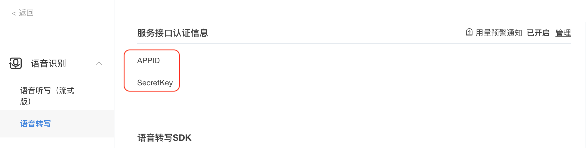

# Speech2Text

使用 [Xue Fei API](https://www.xfyun.cn/) 进行语音转写，适用于将上课、会议录音内容转写成文本，进行课堂笔记、文档的撰写。

## 运行步骤:
1. 申请讯飞开放平台的免费资源（一般是5个小时，超过就需要购买），[语音转写服务](https://www.xfyun.cn/services/lfasr)
2. 输入讯飞开放平台的appid，secret_key和待转写的文件路径: api = RequestApi(appid="", secret_key="", upload_file_path=r"")
3. run 'python weblfasr_python3_demo.py > nohup.out', 复制nohup.out生成的结果中(/getResult success:{'data': --- })，得到raw_data.txt文件，存到当前目录
4. run 'python read_raw_data_xunfei.py', 生成最终的txt文件。

## 更新日志:
2021/12/17: 可直接运行run 'python weblfasr_python3_demo.py，得到raw_data.txt文件，存到当前目录

## 注意：
**讯飞开放平台的appid，secret_key，如下所示：**

